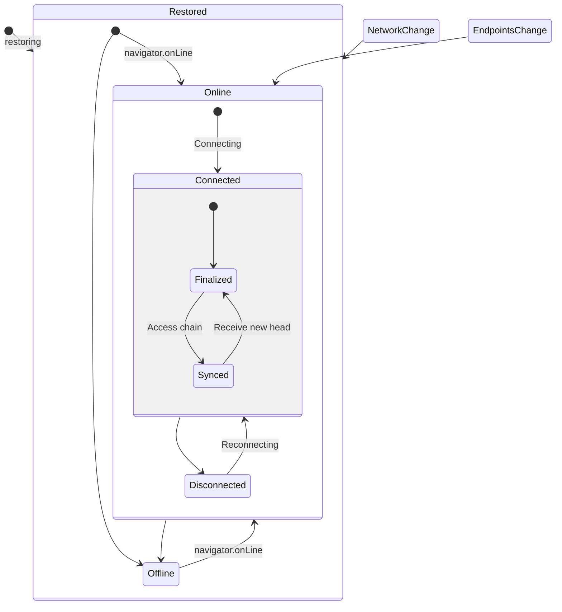

```mermaid
stateDiagram-v2
    [*] --> Restored: restoring

    NetworkChange --> Restored

    EndpointsChange --> Online

    state Restored {
        [*] --> Offline
        [*] --> Online : navigator.onLine
        Offline --> Online : navigator.onLine
        Online --> Offline
    }

    state Online {
        [*] --> Connected: Connecting
        Connected --> Disconnected
        Disconnected --> Connected : Reconnecting
        state Connected {
            [*] --> Finalized
            Finalized --> Synced : Access chain
            Synced --> Finalized : Receive new head
        }
    }
```

Also:
* accounts can be present or not
* polkassembly data are accessed on the flow
* auto-reconnect if first API connection fails or then stalls / is too slow